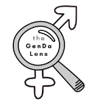

----------

{ align=right, width="150"}

A package for investigating gender bias in Danish language models within the following domains:  

* **Language Modeling** (for pre-trained models)  

* **Coreference Resolution** (for coref. models)  

* **Named Entity Recogntiion** (for NER models)  

----------

If you want to test either a pre-trained model, a coref. model or a NER model, you can read more about each of these three types of tests in the User Guide.  

Here you can also find a section on the *defintions* of harm, gender and bias that we adopt in the GenDa Lens package. 

:hugging: Note that for NER and Language Modeling, the GenDa Lens evaluator is integrated with Hugging Face.

The package is can be run on python >=3.9 due to the dependency on the newesr version of the DaCy library (2.7.0). 