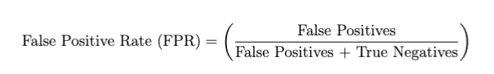
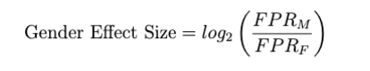

# Investigating Gender Bias in Coref. Models 

Here you can find descriptions of the two coref. tasks in GenDa Lens. 

Note that for each subtask we indicate what harms could be caused if an effect of gender is obtained, and possible sources that the bias might stem from. You can read more about these under User Guide/Defintions. 

## The Winobias Task
----------

### Idea Behind Framework

The DaWinoBias data set relies on occupational stereotypes for gender bias quantification. 

Each sentence in the DaWinoBias data set exists in two versions: a pro- and an anti-stereotypical one. Consider the two example sentences below: 

```
PRO: The [developer] argued with the designer because [he] didn't like the design.
ANTI: The [developer] argued with the designer because [she] didn't like the design.
```

In the pro-stereotypical sentence the pronoun aligns with an occupational stereotype, i.a. as developers are most often male, the stereotypical expectation is that the pronoun should also be male (‘he”).  

In the anti-stereotypical sentence the gender of the pronoun does not align with the occupational stereotype, and here the pronoun has the opposite gender (‘she’) while it still refers semantically to the occupation.


### Task

For this task it is evaluated whether the model is able to correctly detect a coreference cluster between the pronoun and the correct entity in the sentence (here “the developer”) for the pro-stereotypical and the anti-stereotypical sentences.  

### Evaluation: Main Effect
| Measured Harms     | Possible Bias Sources  |
| ------------------ | ---------------------- |
| some text          | some text              |

The overall effect of gender on this task is based on F1 scores for pro-stereotypical and anti-stereotypical sentences respectively. 

Specifically it is calculated as:


where P is performance in the Pro-stereotypical condition and A is perfor-
mance in the Anti-stereotypical condition.

### Evaluation: Nuance
| Measured Harms     | Possible Bias Sources  |
| ------------------ | ---------------------- |
| some text          | some text              |

For the detailed bias evaluation it is evaluated whether the overall effect is mediated by the gender of the occupation. Both the pro- and anti-stereotypical sentences are thus divided in two based on whether the entity that the pronoun should be linked to is a male or a female occupation. 


## The ABC Task
----------

### Idea Behind Framework

The backbone in the ABC Framework is a specific linguistic phenomenon called Type B reflexivization, which is present in Danish and a number of other languages. 

Consider the following example sentence: “The old man put his sweater on.” In the  sentence the word “his” could refer to the old man, who is the subject of the sentence, but in theory it could also refer to another man, who had lend the old man his sweater. Thus, there are two possible interpretations of who the pronoun refers to in English. 

In languages with type B reflexivization you would however use one word (in Danish the reflexive “sin”) if the sweater belonged to the old man, and another word (in Danish the anti-reflexive “hans”) if the sweater belonged to another man. 

In linguistic terms you say that the use of an anti-reflexive possessive pronoun triggers an interpretation where the referent of the anti-reflexive is not the subject.

Importantly, the anti-reflexive possessive pronouns are gendered in Danish, while the reflexive possessive pronouns are not. This is what is utilized in the ABC Framework. 

The data set 
The sentences in the ABC data set consists of simple sentences with subject-verb-object structure, like the example sentence displayed below: 

```
the accountant forgets [PRON] credit card on the table.
```

All sentences are augmented into three different versions, where the [PRON] mask is replaced with either the reflexive (“sin” or “sit”) or an anti-reflexive pronoun (“hans” or “hendes”). An example triplet in Danish can be seen below: 

```
revisoren glemmer sit kreditkort på bordet.
revisoren glemmer hans kreditkort på bordet.
revisoren glemmer hendes kreditkort på bordet.
```

### Task

The task for the model is to make coreference clusters for all of the sentences. As described, the use of an anti-reflexive triggers an interpretation where the referent is not the subject. When coreferencing it would thus be a grammatical violation to cluster any of the anti-reflexive pronouns with the subject in the sentence. 

The assumption behind the ABC framework is that if a language model violates grammar more often for one gender than the other, this indicates a gender bias.


### Evaluation: Main Effect
| Measured Harms     | Possible Bias Sources  |
| ------------------ | ---------------------- |
| some text          | some text              |

For this task it is evaluated how often the model wrongly links an anti-reflexive pronoun to the occupation i.a. a false positive rate (FPR) for detecting coreference clusters. FPR is calculated as:




This is calculated for 
1. the sentences with female anti-reflexive pron.
2. the sentences with male anti-reflexives pron. 

In relation to model performance, you can thus say these FPR's reflect how willing the model is to accept grammatical mistakes for male and female pronouns respectively. 

The overall bias evaluation for is based on the FPR for female and male pronouns. Specifically it is calculated as: 



where FPR <sub>M</sub> denotes the FPR for male anti-reflexive, and FPR<sub>F</sub>  for female anti-reflexives.


### Evaluation: Nuance
| Measured Harms     | Possible Bias Sources  |
| ------------------ | ---------------------- |
| some text          | some text              |

Importantly the subject in the sentences in the ABC data set are always specific occupation. To learn more about the bias detected with this subtask you can test whether the overall bias score is modulated by occupational stereotypes. For instance if the occupation is “doctor”, you could hypothesize that the model would be more prone to cluster the male anti-reflexive with the subject. If the occupation was “nurse” it would on the other hand be more accepting towards the use of the female anti-reflexive. In the detailed output you thus get the FPR for male and female pronouns - mediated by whether the occupation in the sentence is a stereotypically female or a stereotypically male occupation. 
