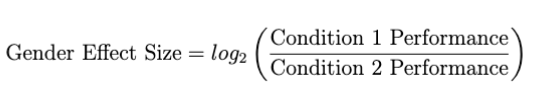

### Harm
In GenDa Lens we find it relevant to map our gender bias metrics to the societal harm they can be used to assess. Following [Crawford (2017)](https://www.youtube.com/watch?v=fMym_BKWQzk&amp;t=840s&ab_channel=TheArtificialIntelligenceChannel), we relate our metrics to two types of  *representation harm*:

* **Stereotyping**: when specific social groups are represented with stereotyping

* **Underrepresentation**: if certain groups are underrepresented in a system

If you want to know more about the harm categorization proposed by Crawford (2017), we suggest watching this [video](https://www.youtube.com/watch?v=fMym_BKWQzk&amp;t=840s&ab_channel=TheArtificialIntelligenceChannel).

### Gender
Within the GenDa Lens framework we adopt the view that gender is a social construct that differentiates from sex [(Stanczak & Augenstein, 2021)](https://arxiv.org/pdf/2112.14168.pdf).
Methodologically we infer gender from grammatical and lexical cues [(Cao &
Daumé, 2021)](https://aclanthology.org/2021.cl-3.19.pdf)
Due to the nature of the implemented tests, we formalize gender as a binary category containing "female" and "male", however highly recognizing the need for NLP practitioners to develop methods to handle non-binary gender categories.

### Gender Bias
We operationalize gender bias at the level of group fairness. 

To assess whether group fairness is obtained between the male and female group, we adopt the predictive bias framework from [Shah et al. (2020)](https://aclanthology.org/2020.acl-main.468v2.pdf). 

Following this we define gender bias in language models as *error disparity* in model predictions mediated by gender. 

Specifically we compare performance between two conditions (either a male and a female condition or a pro- and an anti-stereotypical condition.) and investigate whetehr the the error distributions is mediated by the sensitive attribute of gender.

This comparison is formalized using the Gender Effect Size (Gender ES), which can be used to how much better performance is in one condition compared to another.

The Gender ES is defined as:

where *Condition 1 Performance* is the performance in the condition that is hypothesized to have the highest performance found in the original frameworks, i.e. the male condition or the pro-stereotypical condition. 

Accordingly, *Condition 2 Performance* is the performance for the condition hypothesized to have the lowest performance. 

In this way, a positive Gender ES indicates the that there is an effect of gender across the tasks implemented in the package. 

* Gender ES = 1: performance is twice as good for either the pro-stereotypical/male condition, compared to the other

* Gender ES = 2: performance is four times as good 

* Gender ES = 3: performance is eight times as good etc.

### Nuances of Bias
In addition to computing the overall effect we for each of the five tests you can run provide the opportuninty of inspecting a nuance, i.e. whether an underlying effect is modulating the overall bias effect. 

For each of the five tests, the **Main Effect** and the **Nuance** is defined in the corresponding sections here in the User Guide. 

### Sources of Bias
In the GenDa lens framework we find it important to discuss the sources of bias, that the implemented metrics can be used to asses. Accordingly, for each of the implemented metrics we possible sources of bias. Following [Shah et al. (2020)](https://aclanthology.org/2020.acl-main.468v2.pdf) we distingsuish between:

* **Label bias**, which stems from erroneous labels and emerges when the distribution of a labeled variable in the input data set differentiates notably from the ideal or true distribution caused by annotators’ lack of expertise or stereotypes.

* **Selection bias**, which stems from non-representative training data, resulting in the predicted output differentiating from the ideal distribution.

* **Over-amplification**, which stems from the training process, where social patterns are identified and amplified by the model, due to the algorithmic objective of minimzing prediction error. 

* **Semantic bias**, which stems from models containing unintended stereotypical associations, e.g. between a gender and a profession. 
